# Portfolio Optimization
Heuristics for cardinality constrained portfolio optimisation


<p align="center">
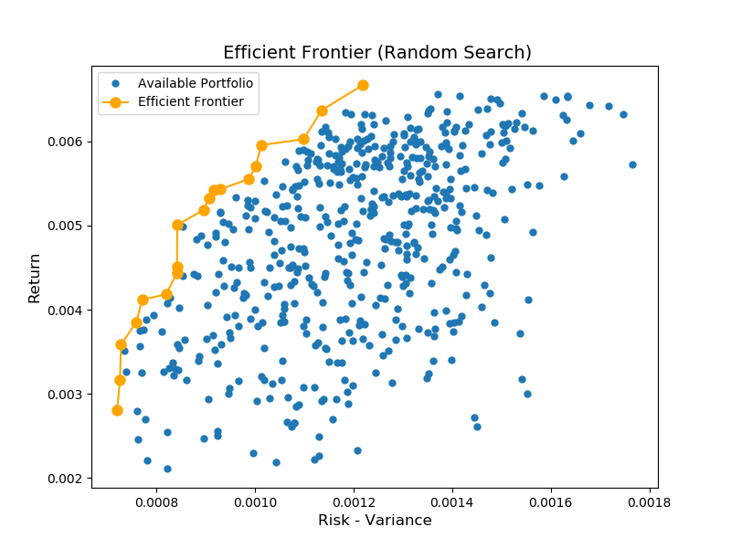 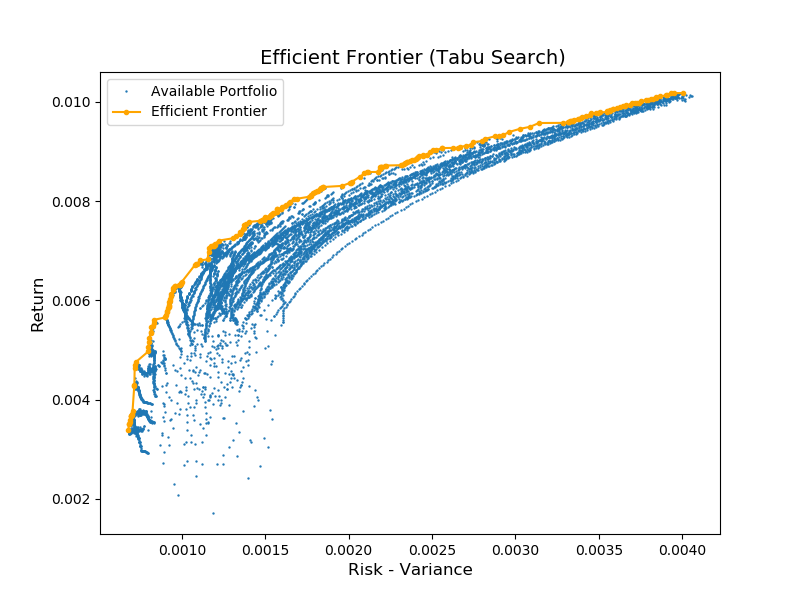 
</p>

<br/>
 


## Summary
The current project aims to make an investment decision of £1 billion, by identifying the best portfolio of ten assets determined by the level of return and risk associated with them. Considering also that those assets are not independent of each other, hence the optimising equation also contains the correlation among assets. The proportion of total investment (£1B) can vary for each of the ten assets in the portfolio, however a constraint of a minimum proportion of investment, i.e. £100,000, was levied.  

The two key objectives identified for reaching the desired result were:

- Minimization of the expected variance (risk) of the portfolio
- Maximization of the expected return of the portfolio
 
 With the use of efficient algorithms for portfolio optimization we can derive the optimal combination of assets to invest on and the relationship between the revenue and risk. Heuristic algorithms enable us to guide the solution search to optimum solutions fast and efficiently, as the examination of all possible combination of assets is computationally expensive.
In order to validate our findings, a sensitivity analysis was performed by examining different input parameters of the algorithms and critically comparing the returns they yielded.
After examining the trade-off between return and risk, inferior sets of assets which had relatively lower return and higher risk were eliminated from further analysis. For each stock market, a set of optimal solutions (efficient solutions) was produced that was later used as the basis for comparison of the five markets. As a result, underperforming markets were eliminated and thus, a well-informed decision can be made to invest on the best stock market based on the desired return and risk.  
Based on the comparison of the efficient frontiers of the 5 markets, we can conclude that, overall, the investments on DAX outperform all candidate investment portfolios for FTSE, S&P and Nikkei, and can be an ideal investment opportunity. DAX investments qualify as high return and low risk. By investing on DAX stock, we can have a maximum return of approximately £9 million with a risk of £2 million. However, analysis yielded that without considering the risk, investing on Hang Seng market can result to the highest possible return among all stock markets. Investing on ten assets of the Hang Seng market we can obtain a maximum return of slightly more than £10 million. Though, Investments on Hang Seng market with returns higher than £8 million are especially risky. 

## Objective

Let's assume the following scenario. A fund manager approaches us to optimise their investment portfolio of assets. They have a budget of £ 1 billion  (£1B) and they want to invest it on exactly 10 assets. A decision must be made, for each asset that is included, about the proportion of the £1B that is invested on it, which must be larger than a given minimum transaction level (min-buy) of 1% (or 0.01). We are given for each asset its expected return of investment and the standard deviation of this return (which can be seen as the risk associated with an asset). The asset returns are not independent, and we are also given the correlation between assets. 


Based on the paper (see references) we decide to minimise the following objective:
<!-- ```math
f(s) = \lambda \cdot CoVar(s) - (1 - \lambda) \cdot R(s)
``` -->

<p align="center">
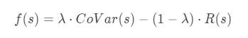 
<p/>

<br/>

by minimizing the expected variance of the portfolio and maximizing the expected return of the portfolio:

<!-- ```math
CoVar = \sum_{i=1}^N \sum_{j=1}^N w_i w_j \rho_{ij} \sigma_i \sigma_j 
```

```math
R = \sum_{i=1}^N w_i \mu_i 
``` -->

<p align="center">
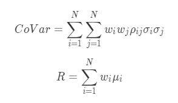 
<p/>


<br/>


where $s$ is a candidate solution to the problem, $N$ is the number of assets available, $\mu_i$ is the expected return of asset $i(i = 1,2,...,N)$, $\rho_{ij}$ is the correlation between assets $i$ and $j$, $\sigma_i$ is the standard deviation of the return of asset $i$, and $R$ is the expected return. We must decide the proportions $w_i$ of £1B to be invested in assets $i = 1,2,...,N$, where $w_i=0$ means asset $i$ is not included in the portfolio.


<br/>

## Plan of Attack

1. Initially, we'll apply the algorithms to each dataset (there are five of them) using a maximum of 1000x$N$ solution evaluations for each run. Each solution evaluation is a call to Algorithm 1 (evaluate) in the accompanying paper ( $E = 1$, $\lambda = 0.5$).  Each run will be repeated with a different initial random seed 30 times and the values of _R_ and _CoVar_ of the best solution returned by each run will be collected.
2. After analysing the above results, we'll examine how the performance of the heuristic changes when we change the parameter L.  Specifically, the following values of L will be examined:

<!-- ```math
L^* = [1,2,5,7,10,15]
``` -->


<p align="center">
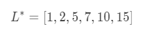 
<p/>


3. After deciding which parameter L maximizes the revenue, we'll explore the trade-off between the two objectives (_R_ and _CoVar_). To do so, an efficient frontier will be produced which examines 50 different $\lambda$ values drawn from the range [0,1] (E =
50 in the research paper) using 1000x$N$ solution evaluations for each $\lambda$ value. 


<br/>

## Datasets


To test our heuristic 5 test data-sets were used with the weekly prices of five different capital market indices drawn from around the world. Specifically, the weekly prices of the following stock markets were considered: 


Stock Markets | Number of assets (N)
---------|:---------:
 Hang Seng (Hong Kong)| 31
 DAX 100 (Germany)  | 85
 FTSE 100 (UK) | 89
 S&P 100 (USA) | 98
 Nikkei 225 (Japan) | 225
 
<br/>

### Format of the datasets

All five datasets have the following format:
<pre>
31                  # number of assets (N)
.001309 .043208     # expected return, standard deviation of return of asset 1
.004177 .040258     # expected return, standard deviation of return of asset 2
...
.001487 .041342     # expected return, standard deviation of return of asset N
1 1 1.000000        # correlation between assets 1 and 1
1 2 .562289         # correlation between assets 1 and 2
...
30 31 .629523       # correlation between assets 30 and 31
31 31 .379162       # correlation between assets 31 and 31
</pre>


<br/>

## Optimization Algorithms

### Random Search

The first algorithm implemented, Random Search, included continuous generation and evaluation of sets of 10 random assets in order to achieve as many combinations of different assets as possible. Only those combinations were considered that showed dominating behaviour in terms of higher return and lower risk simultaneously as compared to others, where equal importance was given to risk and return

The results of Random Search (see appendix tables) show that the most rewarding market is Hang Seng in terms of return, however the principal of risk-return trade-off applies here, as the highest return is also accompanied with highest risk. In addition, DAX market can be regarded as the safest choice with minimum risk, reasonable return and least deviation from the mean. FTSE is also relatively a stable choice after DAX though, while Nikkei is the least attractive option as the mean return is lowermost, together with very high risk and standard deviation.

<br/>

### Heuristic Algorithm (Tabu Search)

In search of the most optimal solution another algorithm was used, Tabu Search (Chang et al, 2000). What differentiates this algorithm from the previous one is that instead of randomly generating and evaluating a solution each time, it creates a number of possible solutions at once and then evaluates them to get the best solution. When this is completed it accesses the best solution's assets one by one by changing this asset with a new one and then considering if the revenue-risk association improves by such change.

The results of the Tabu Search algorithm reaffirm the outcomes of the Random Search algorithm by reinforcing the idea of Risk-return trade-off. As per the Tabu search too, Hang Seng has the greatest return with the greatest risk whereas Nikkei has the lowest return with lowest risk. The DAX portfolio is the most stable choice with the lowest risk and relatively high returns. However, the degree of risk and return have substantially increased in the Tabu Search algorithm. 


The appropriate tables (see appendix A) were created in order to compare the results of both models (Random and Tabu search), the main characteristics under which they are being compared are: Mean, Standard Deviation and Range of Evaluation. Findings:

-	The Tabu search achieves a higher average of revenue or return in all the scenarios.
-	However, the Tabu Search displays a higher risk and standard deviation compared to Random Search.
-	The Tabu search considers a wider range of return values than the Random search.


### Parameter Optimization (L*)

The L* (Tabu Tenure) is a value that is used to lock a sub-optimal asset for a fixed number of evaluations where it cannot be considered as a possible investment opportunity. Thus, by using the Tabu Tenure, the examination of sub-optimal or identical assets are reduced and the number of different combinations are maximized, saving both time and increasing accuracy. Box-Plots of the returns for different Tabu Tenures for each market help in the identification of the parameters that provided the most optimal results.

The analysis starts in the f value Box-Plots considering the lower values with the least variance, for example in the Market 1 (Hang Seng) we selected L = 1, 5, and 7, as they minimise the difference between risk and return. However, in order to conclude, the average value of expected return is taken into consideration in the return Box-Plots which lead to selecting L = 2 and 5 as they have the highest expected value. By combining these two analysis it is possible to conclude that L = 5 minimizes the objective function. This process was repeated for the different Datasets and different L values were chosen, however, due to the randomness non definitive value of L could be defined which lead to taking an empirical approach for selecting the parameter value.


<br/>

**Hang Seng**

<p align="center">
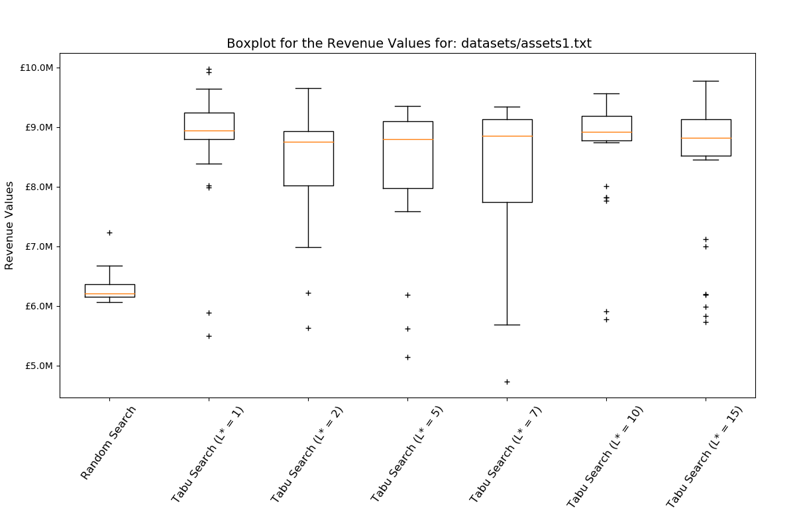 
</p>

---
**DAX**

<p align="center">
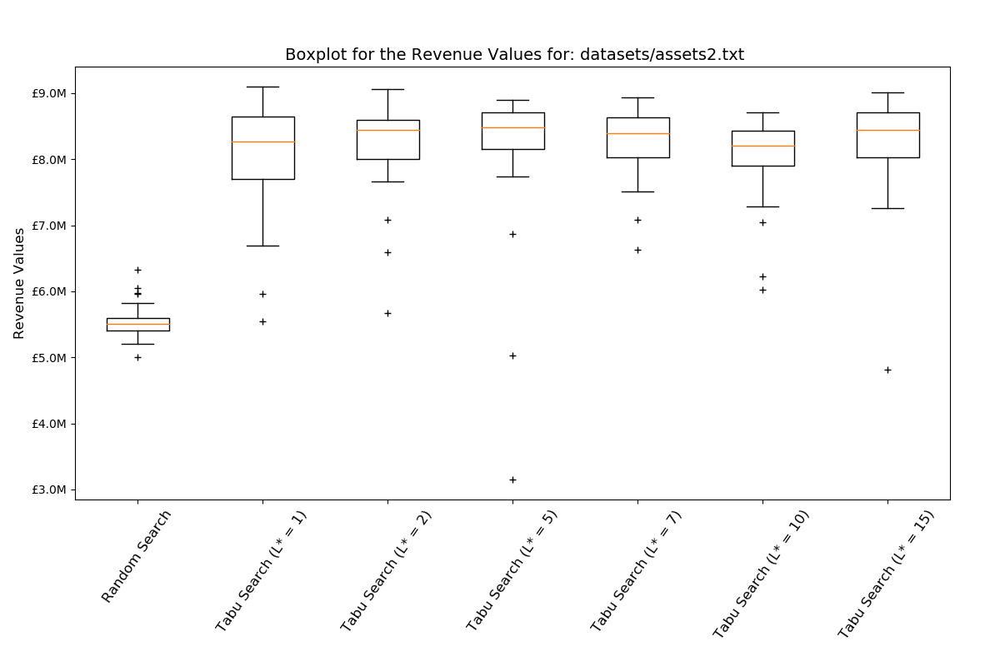 
</p>

---
**FTSE**

<p align="center">
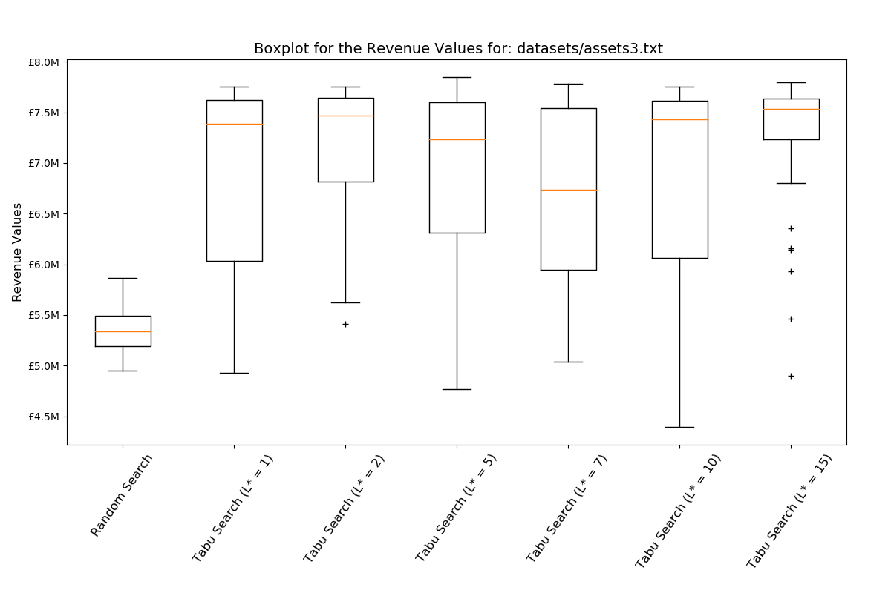 
</p>

---
**S&P**

<p align="center">
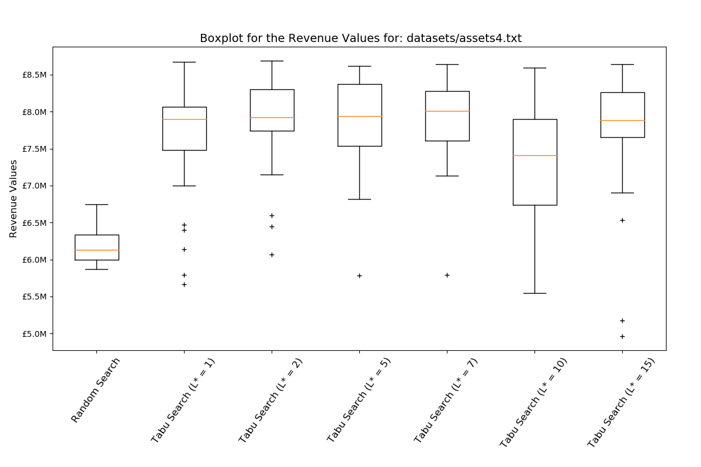 
</p>

---
**Nikkei**

<p align="center">
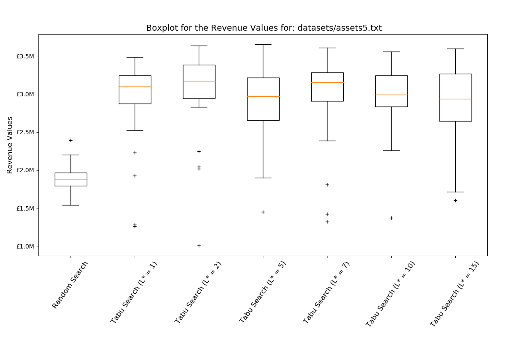 
</p>

---


Several simulations of the problems were repeated in order to establish a robust approximation for the parameter value that provides optimal results. Empirically speaking, it was concluded that the L value is highly correlated to the size of the problem studied. Our understanding of the algorithm used suggests the same, large L* in small datasets restricts the process around a solution identified as best (local maximum) and fails to access alterations that would result to a better one or possibly the best. For this reason, it was judged as crucial to use small values for markets of few assets. On the other hand, a small value to research a big market fails to consider different combinations in the context that “wastes” resources for portfolios perhaps already examined, making clear the need to use a larger value. In this project the below interval rule was established to approximate optimal L* where $n$  is the size of the problem:

<!-- 
```math 
[0.5\sqrt{n}, 2\sqrt{n}]
``` -->


<p align="center">
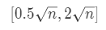 
</p>

For the reasons provided above and in accordance to our rule we decided to use the following:


<p align="center">

| Stock Market | L* value  |
|--------------|----------:|
| Hang Seng    | 5         |
| DAX          | 7         |
| FTSE         | 7         |
| S&P          | 7         |
| Nikkei       | 10        |

</p>
 

<br/>

## Revenue - Risk Trade off 

To provide better investment information, the trade-off between Risk and Return (CoVar and R, respectively) was explored. An efficient frontier, for both algorithms and all five markets, was conceived by testing how the portfolios values changed when the preferences of the decision maker lied on return over risk or vice versa. The dominating portfolios  were kept as approximations of the efficient frontier. 
The following figures depict the aforementioned trade-off where the blue points represent dominated portfolios and the yellow line consists of all those portfolios that have either better return or lower risk than each other, but never both.
Naturally, the first algorithm fails to achieve as large returns as the second one. When it comes to the five different markets it is observed, as was previously, that Tabu Search outperforms Random Search in terms of revenues whilst manages to find more efficient investment portfolios, thus offering flexibility to the decision maker. Visual comparison between the available markets can also be conducted in Figure 3 where the efficient frontiers are summarized in a common graph.

<br/>

**Hang Seng**

<p align="center">
  
</p>

---
**DAX**

<p align="center">
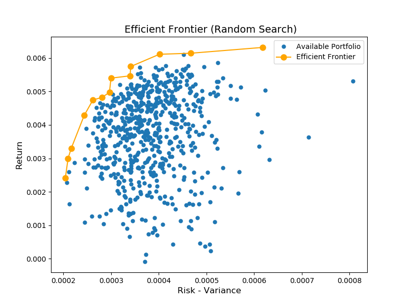 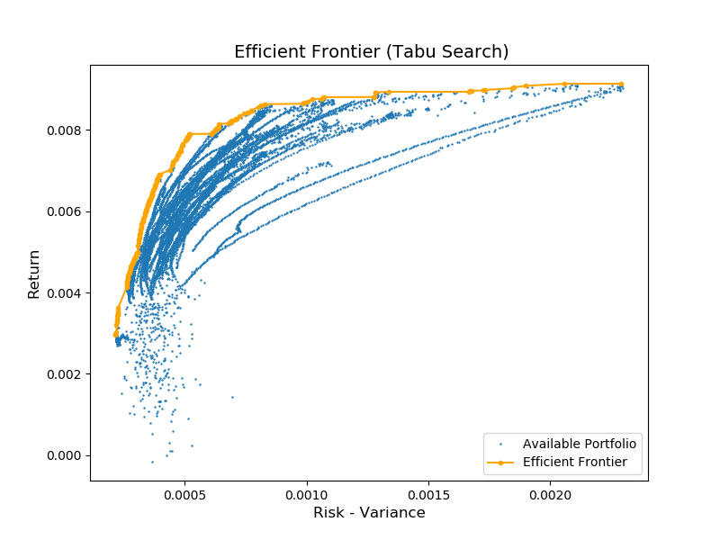 
</p>

***

**FTSE**
<p align="center">
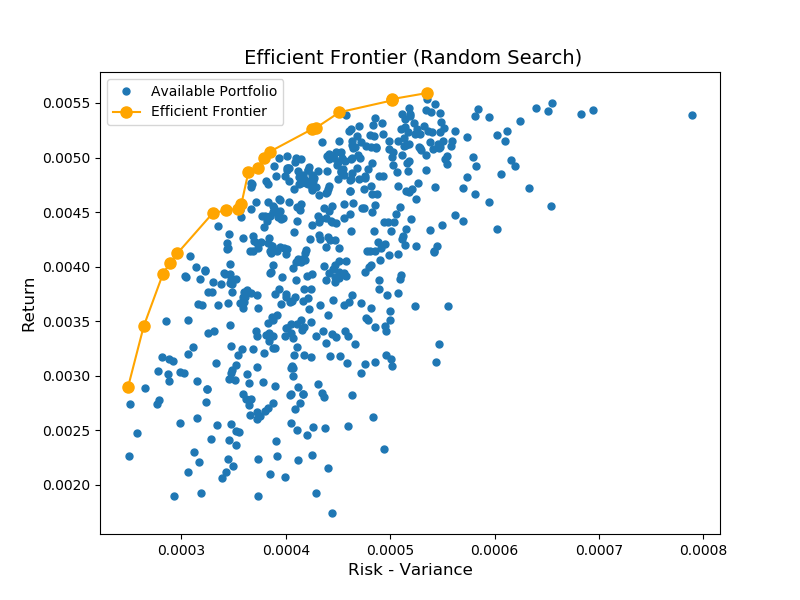 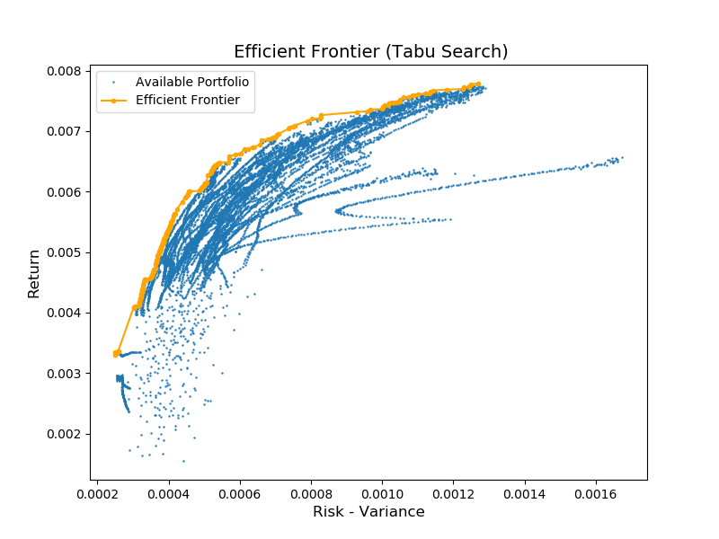 
</p>

***
**S&P**
<p align="center">
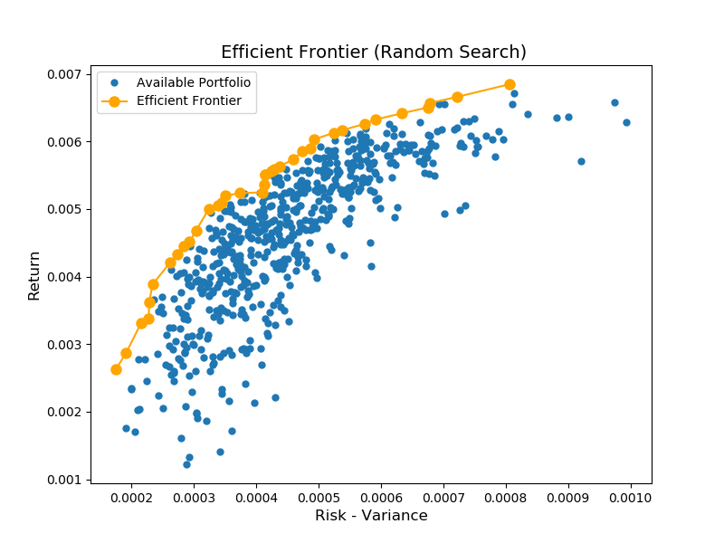 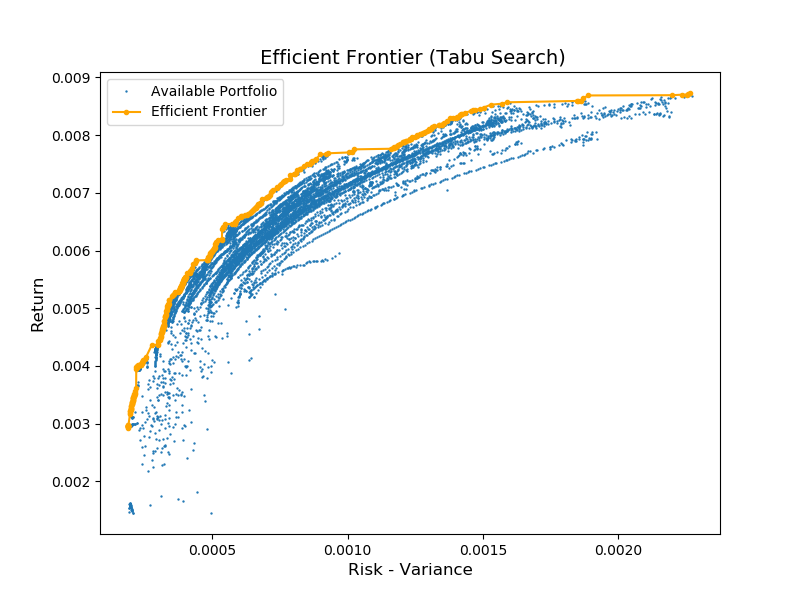 
</p>

***
**Nikkei**
<p align="center">
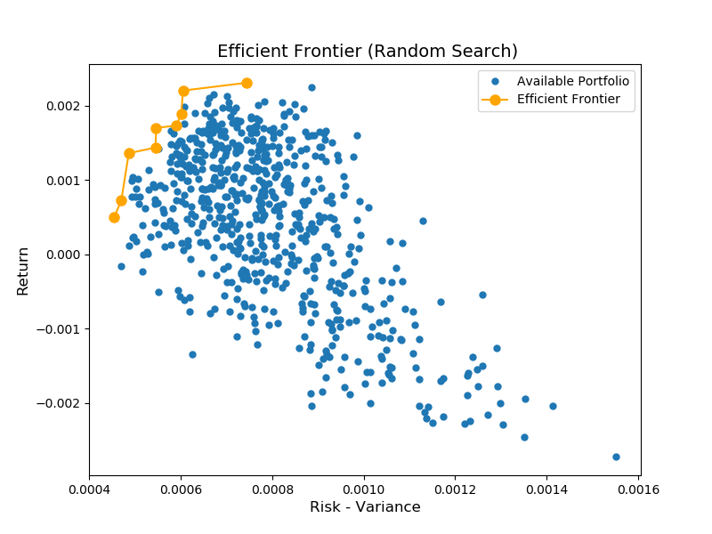 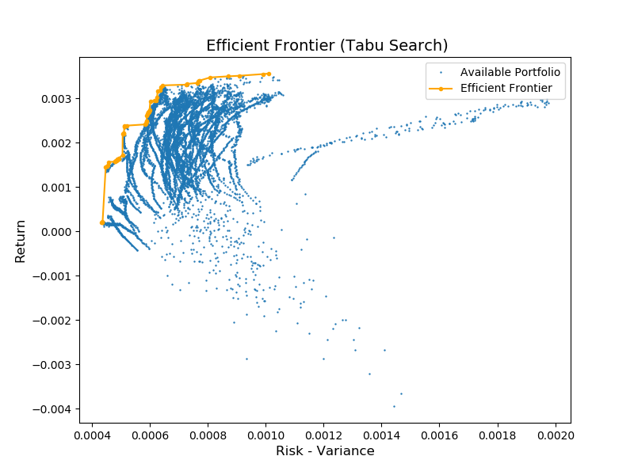 
</p>


<br/>

## Market comparison

It is easily identified that some markets are dominated by others in the context of either lower risk/greater return or both, with only two contenders standing at the end. Hang Seng market has a return fluctuating from £3,3940,000 - £10,180,000 with risks of £679,000 - £4,005,000 when at the same time DAX includes a portfolio with returns from £2,963,000 to £9,134,163 and a risk range from £216,000 to £2,292,004. Although DAX outperforms Hang Seng and should be preferred for expected returns of up to £9,000,000 in lower risk scenarios, the latter should not be neglected immediately since it supports higher returns along with higher risks, which would be fitted for risk taker investors.


<p align="center">
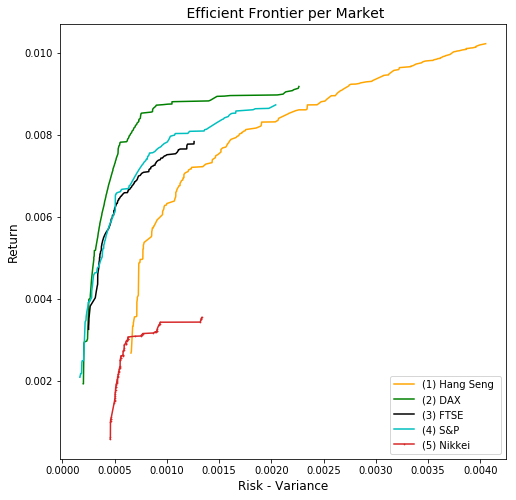 
</p>


<br/>

**The implementation is based on the following research paper:**
T.-J. Chang, N. Meade, J.E. Beasley, Y.M. Sharaiha, Heuristics for cardinality constrained portfolio optimisation, Computers &Operations Research, 27(13):1271-1302, 2000,
https://doi.org/10.1016/S0305-0548(99)00074-X


## Appendix


<p >Hang Seng</p>
<table class="table table-striped table-bordered">
<thead>
<tr>
<th></th>
<th style="text-align:right">Random Search</th>
<th style="text-align:right"></th>
<th style="text-align:right">Tabu Search</th>
<th style="text-align:right"></th>
</tr>
</thead>
<tbody>
<tr>
<td></td>
<td style="text-align:right">R</td>
<td style="text-align:right">CoVar</td>
<td style="text-align:right">R</td>
<td style="text-align:right">CoVar</td>
</tr>
<tr>
<td>Mean</td>
<td style="text-align:right">6,294</td>
<td style="text-align:right">1,306</td>
<td style="text-align:right">8,688</td>
<td style="text-align:right">2,338</td>
</tr>
<tr>
<td>Standard deviation</td>
<td style="text-align:right">244</td>
<td style="text-align:right">183</td>
<td style="text-align:right">782</td>
<td style="text-align:right">395</td>
</tr>
<tr>
<td>Minimum</td>
<td style="text-align:right">6,057</td>
<td style="text-align:right">1,034</td>
<td style="text-align:right">5,114</td>
<td style="text-align:right">971</td>
</tr>
<tr>
<td>25%</td>
<td style="text-align:right">6,145</td>
<td style="text-align:right">1,191</td>
<td style="text-align:right">8,735</td>
<td style="text-align:right">2,248</td>
</tr>
<tr>
<td>50%</td>
<td style="text-align:right">6,210</td>
<td style="text-align:right">1,271</td>
<td style="text-align:right">8,864</td>
<td style="text-align:right">2,343</td>
</tr>
<tr>
<td>75%</td>
<td style="text-align:right">6,360</td>
<td style="text-align:right">1,363</td>
<td style="text-align:right">9,036</td>
<td style="text-align:right">2,573</td>
</tr>
<tr>
<td>Maximum</td>
<td style="text-align:right">7,230</td>
<td style="text-align:right">1,905</td>
<td style="text-align:right">9,357</td>
<td style="text-align:right">2,953</td>
</tr>
</tbody>
</table>
<hr>
<p>DAX</p>
<table class="table table-striped table-bordered">
<thead>
<tr>
<th></th>
<th style="text-align:right">Random Search</th>
<th style="text-align:right"></th>
<th style="text-align:right">Tabu Search</th>
<th style="text-align:right"></th>
</tr>
</thead>
<tbody>
<tr>
<td>Mean</td>
<td style="text-align:right">5,554</td>
<td style="text-align:right">427</td>
<td style="text-align:right">8,068</td>
<td style="text-align:right">943</td>
</tr>
<tr>
<td>Standard deviation</td>
<td style="text-align:right">272</td>
<td style="text-align:right">78</td>
<td style="text-align:right">867</td>
<td style="text-align:right">327</td>
</tr>
<tr>
<td>Minimum</td>
<td style="text-align:right">5,002</td>
<td style="text-align:right">321</td>
<td style="text-align:right">5,254</td>
<td style="text-align:right">573</td>
</tr>
<tr>
<td>25%</td>
<td style="text-align:right">5,404</td>
<td style="text-align:right">366</td>
<td style="text-align:right">7,889</td>
<td style="text-align:right">732</td>
</tr>
<tr>
<td>50%</td>
<td style="text-align:right">5,509</td>
<td style="text-align:right">416</td>
<td style="text-align:right">8,455</td>
<td style="text-align:right">837</td>
</tr>
<tr>
<td>75%</td>
<td style="text-align:right">5,597</td>
<td style="text-align:right">466</td>
<td style="text-align:right">8,581</td>
<td style="text-align:right">1,052</td>
</tr>
<tr>
<td>Maximum</td>
<td style="text-align:right">6,328</td>
<td style="text-align:right">710</td>
<td style="text-align:right">8,900</td>
<td style="text-align:right">1,916</td>
</tr>
</tbody>
</table>
<hr>
<p>FTSE</p>
<table class="table table-striped table-bordered">
<thead>
<tr>
<th></th>
<th style="text-align:right">Random Search</th>
<th style="text-align:right"></th>
<th style="text-align:right">Tabu Search</th>
<th style="text-align:right"></th>
</tr>
</thead>
<tbody>
<tr>
<td>Mean</td>
<td style="text-align:right">5,351</td>
<td style="text-align:right">518</td>
<td style="text-align:right">6,983</td>
<td style="text-align:right">952</td>
</tr>
<tr>
<td>Standard deviation</td>
<td style="text-align:right">199</td>
<td style="text-align:right">74</td>
<td style="text-align:right">998</td>
<td style="text-align:right">241</td>
</tr>
<tr>
<td>Minimum</td>
<td style="text-align:right">4,953</td>
<td style="text-align:right">371</td>
<td style="text-align:right">4,737</td>
<td style="text-align:right">399</td>
</tr>
<tr>
<td>25%</td>
<td style="text-align:right">5,189</td>
<td style="text-align:right">469</td>
<td style="text-align:right">6,602</td>
<td style="text-align:right">858</td>
</tr>
<tr>
<td>50%</td>
<td style="text-align:right">5,336</td>
<td style="text-align:right">514</td>
<td style="text-align:right">7,494</td>
<td style="text-align:right">993</td>
</tr>
<tr>
<td>75%</td>
<td style="text-align:right">5,489</td>
<td style="text-align:right">550</td>
<td style="text-align:right">7,647</td>
<td style="text-align:right">1,091</td>
</tr>
<tr>
<td>Maximum</td>
<td style="text-align:right">5,863</td>
<td style="text-align:right">683</td>
<td style="text-align:right">7,897</td>
<td style="text-align:right">1,296</td>
</tr>
</tbody>
</table>
<hr>
<p>S&amp;P</p>
<table class="table table-striped table-bordered">
<thead>
<tr>
<th></th>
<th style="text-align:right">Random Search</th>
<th style="text-align:right"></th>
<th style="text-align:right">Tabu Search</th>
<th style="text-align:right"></th>
</tr>
</thead>
<tbody>
<tr>
<td>Mean</td>
<td style="text-align:right">6,190</td>
<td style="text-align:right">646</td>
<td style="text-align:right">7,846</td>
<td style="text-align:right">1,363</td>
</tr>
<tr>
<td>Standard deviation</td>
<td style="text-align:right">234</td>
<td style="text-align:right">113</td>
<td style="text-align:right">590</td>
<td style="text-align:right">369</td>
</tr>
<tr>
<td>Minimum</td>
<td style="text-align:right">5,870</td>
<td style="text-align:right">463</td>
<td style="text-align:right">6,171</td>
<td style="text-align:right">720</td>
</tr>
<tr>
<td>25%</td>
<td style="text-align:right">6,000</td>
<td style="text-align:right">578</td>
<td style="text-align:right">7,513</td>
<td style="text-align:right">1,149</td>
</tr>
<tr>
<td>50%</td>
<td style="text-align:right">6,127</td>
<td style="text-align:right">621</td>
<td style="text-align:right">8,035</td>
<td style="text-align:right">1,393</td>
</tr>
<tr>
<td>75%</td>
<td style="text-align:right">6,340</td>
<td style="text-align:right">696</td>
<td style="text-align:right">8,322</td>
<td style="text-align:right">1,576</td>
</tr>
<tr>
<td>Maximum</td>
<td style="text-align:right">6,750</td>
<td style="text-align:right">1,059</td>
<td style="text-align:right">8,519</td>
<td style="text-align:right">2,225</td>
</tr>
</tbody>
</table>
<hr>
<p>Nikkei</p>
<table class="table table-striped table-bordered">
<thead>
<tr>
<th></th>
<th style="text-align:right">Random Search</th>
<th style="text-align:right"></th>
<th style="text-align:right">Tabu Search</th>
<th style="text-align:right"></th>
</tr>
</thead>
<tbody>
<tr>
<td>Mean</td>
<td style="text-align:right">1,895</td>
<td style="text-align:right">705</td>
<td style="text-align:right">3,064</td>
<td style="text-align:right">913</td>
</tr>
<tr>
<td>Standard deviation</td>
<td style="text-align:right">188</td>
<td style="text-align:right">85</td>
<td style="text-align:right">456</td>
<td style="text-align:right">134</td>
</tr>
<tr>
<td>Minimum</td>
<td style="text-align:right">1,540</td>
<td style="text-align:right">556</td>
<td style="text-align:right">2,070</td>
<td style="text-align:right">691</td>
</tr>
<tr>
<td>25%</td>
<td style="text-align:right">1,791</td>
<td style="text-align:right">639</td>
<td style="text-align:right">2,860</td>
<td style="text-align:right">819</td>
</tr>
<tr>
<td>50%</td>
<td style="text-align:right">1,883</td>
<td style="text-align:right">711</td>
<td style="text-align:right">3,159</td>
<td style="text-align:right">903</td>
</tr>
<tr>
<td>75%</td>
<td style="text-align:right">1,965</td>
<td style="text-align:right">747</td>
<td style="text-align:right">3,431</td>
<td style="text-align:right">1,007</td>
</tr>
<tr>
<td>Maximum</td>
<td style="text-align:right">2,394</td>
<td style="text-align:right">899</td>
<td style="text-align:right">3,687</td>
<td style="text-align:right">1,171</td>
</tr>
</tbody>
</table>
